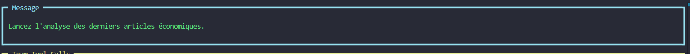
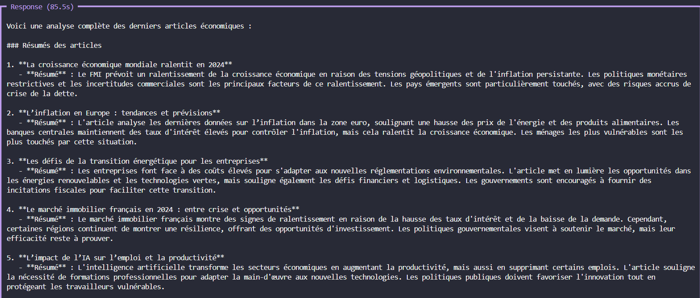

# Projet Multi-Agent d’Analyse Économique avec Agno & Mistral

## Description

Ce projet implémente un système multi-agent utilisant la librairie **Agno** et le modèle **Mistral (mistral-medium)** pour automatiser l’analyse de l’actualité économique.

L’objectif est de :

- Collecter automatiquement les derniers articles économiques via un flux RSS (Reuters).  
- Résumer chaque article pour extraire l’essentiel.  
- Analyser les résumés pour détecter les tendances et risques économiques.  
- Proposer des recommandations stratégiques basées sur ces analyses.

Chaque étape est réalisée par un agent spécialisé, tous coordonnés au sein d’une équipe (Team) Agno.

---

## Architecture

Le système est composé des agents suivants :

- **RSSCollectorAgent** : collecte les articles économiques.  
- **SummarizerAgent** : génère un résumé concis des articles.  
- **AnalyzerAgent** : analyse les résumés pour détecter tendances et risques.  
- **RecommenderAgent** : propose des recommandations stratégiques basées sur l’analyse.

---

## Technologies utilisées

- **Python 3.8+**  
- **Agno** (librairie de gestion multi-agent)  
- **Mistral** (modèle de langage via API, modèle `mistral-medium`)  
- **Feedparser** (pour lire les flux RSS)  
- **dotenv** (gestion sécurisée des clés API)  

---

## Images

### Image 1 : Request

---

### Image 2 : Response

## Prérequis

- Clé API Mistral valide (stockée dans `.env` sous `MISTRAL_API_KEY`)  

